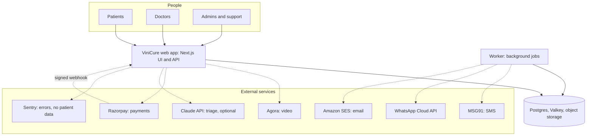
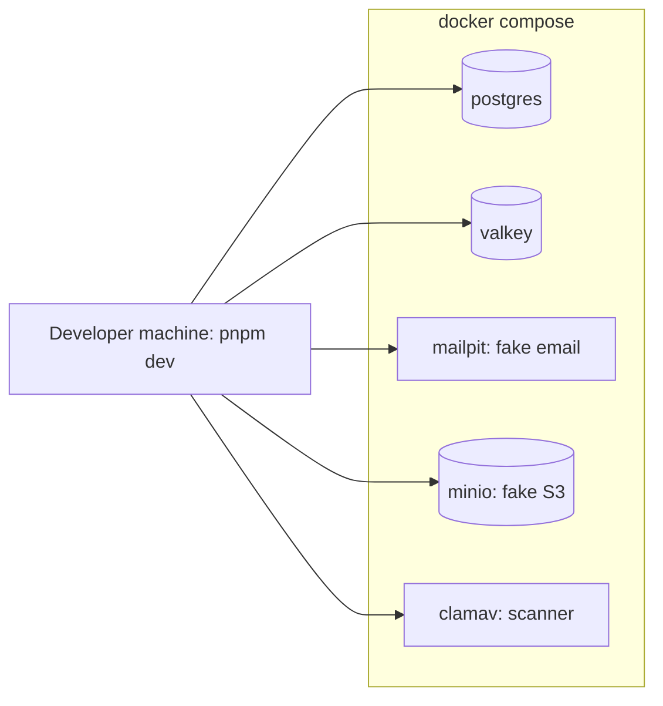
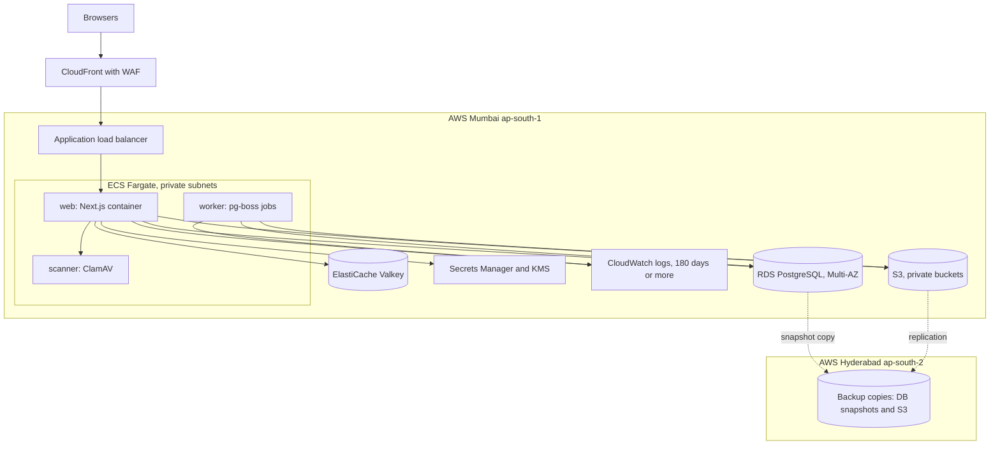
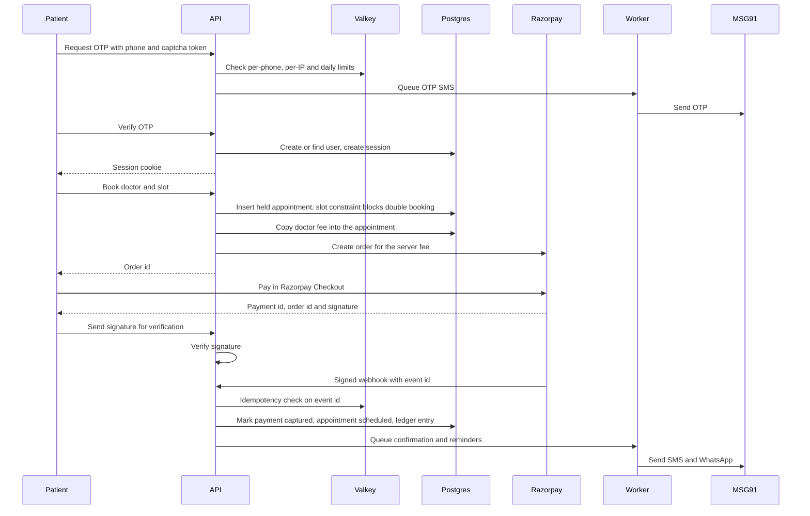
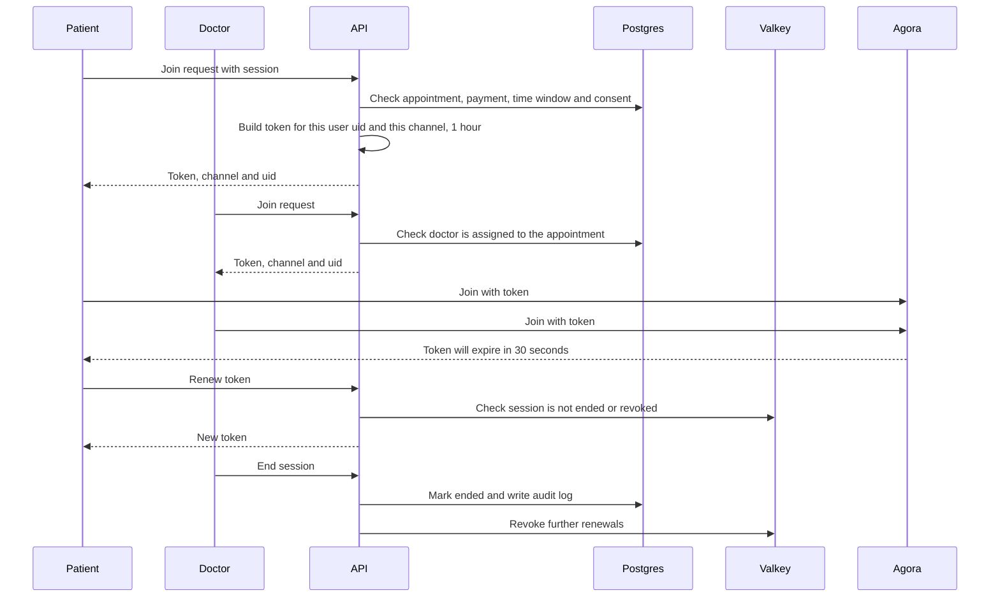
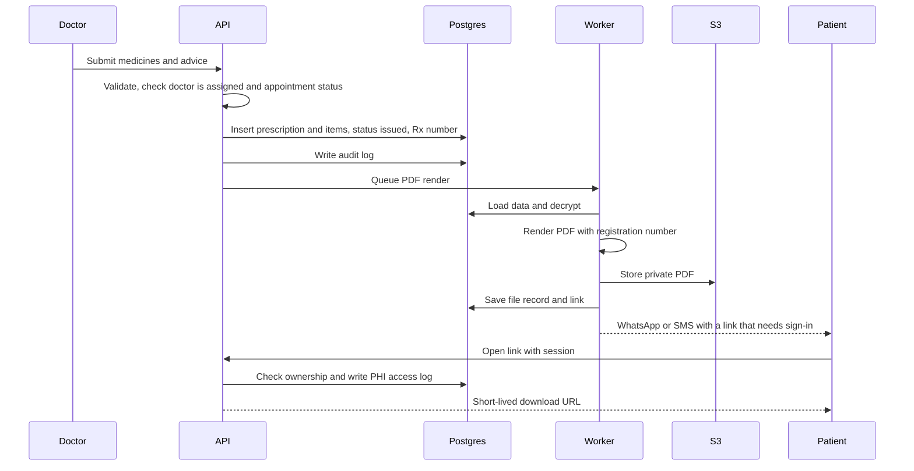
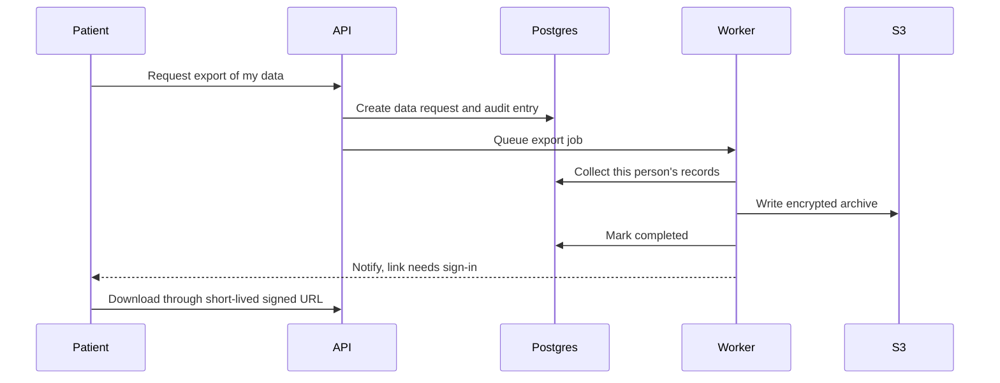
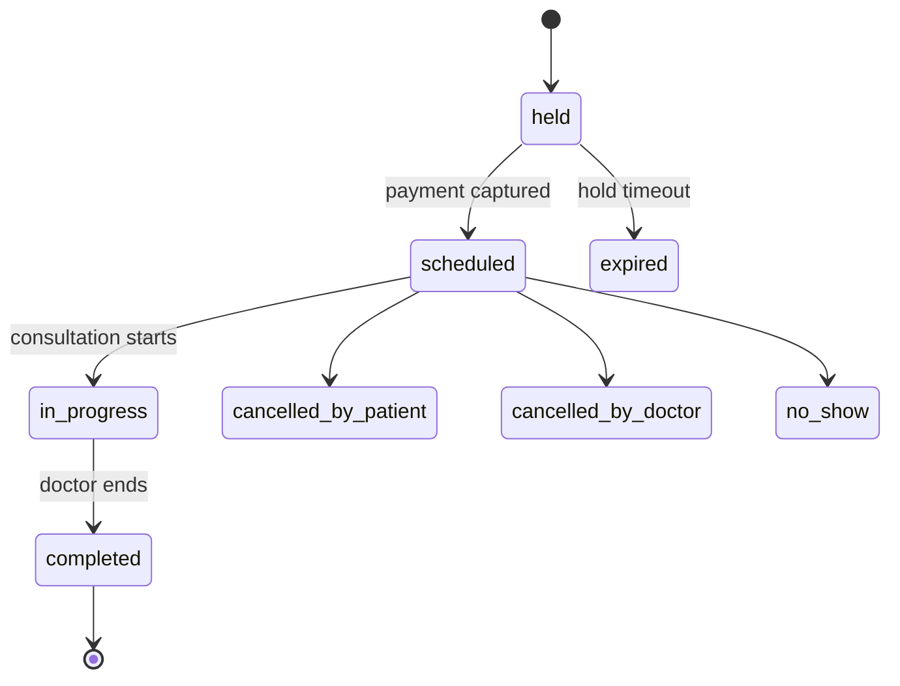
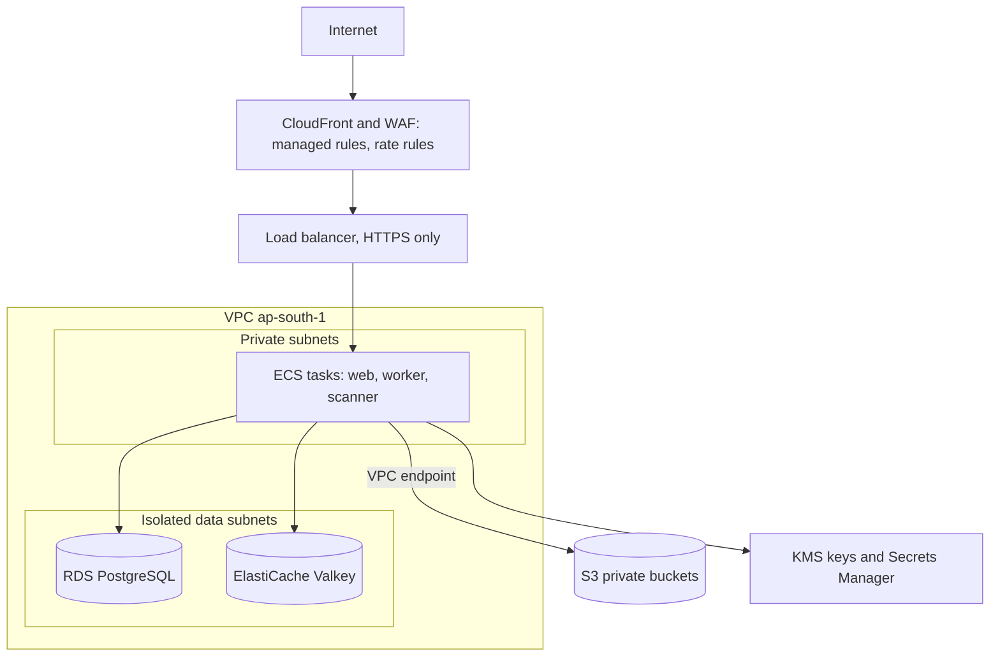
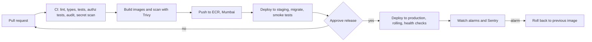

# ViniCure architecture

Status: planning baseline v1, 2 October 2026
Scope: the whole system. Backend detail is in `backend-architecture.md`. Data model is in `er_model.md`. Work tracking is in `../TODO.md`.

ViniCure is a new telemedicine website for India, inspired by the ViniCare codebase. It is built from scratch with the improvements found in the ViniCare review. Nothing is copied blindly (see section 14).

Diagrams use Mermaid. They render on GitHub, GitLab and Notion. Otherwise paste them into mermaid.live.

## Contents

1. [Principles](#1-principles)
2. [System context](#2-system-context)
3. [Tech stack](#3-tech-stack)
4. [Runtime topology](#4-runtime-topology)
5. [Repository layout](#5-repository-layout)
6. [Modules](#6-modules)
7. [Key flows](#7-key-flows)
8. [Security architecture](#8-security-architecture)
9. [Compliance mapping](#9-compliance-mapping)
10. [Environments, Docker and delivery](#10-environments-docker-and-delivery)
11. [Performance targets](#11-performance-targets)
12. [Operations: logs, alerts, backups](#12-operations-logs-alerts-backups)
13. [Decision records](#13-decision-records)
14. [Reuse map from ViniCare](#14-reuse-map-from-vinicare)
15. [Not verified](#15-not-verified)
16. [Sources](#16-sources)

---

## 1. Principles

1. **Patient data stays in India.** Database, files, cache, queue and logs run in AWS Mumbai (`ap-south-1`). Backups are copied to Hyderabad (`ap-south-2`). Third parties receive the minimum data and never clinical content (the Claude triage call is optional and consent-gated).
2. **Server-authoritative.** Browsers never talk to the database or storage directly. Every rule is enforced in the API.
3. **One door for every request.** A single `withApi()` wrapper applies rate limit, authentication, validation, authorization and audit. A test fails if a route skips it.
4. **Boring and few parts.** A modular monolith (one Next.js app plus one worker, from one image) on Postgres. No Kubernetes, no microservices, no extra queue system until a measured limit forces it.
5. **Everything replaceable at the edge.** Video, payments, SMS, WhatsApp, email, AI and file scanning sit behind adapters with fake versions for tests.
6. **Safe to change.** Access-control tests, CI, migrations in SQL, infrastructure as code, and a staging environment from the start.
7. **Honest about uncertainty.** Items we could not confirm are listed in section 15 and tracked in `TODO.md`.

---

## 2. System context



---

## 3. Tech stack

Versions are policies, not frozen numbers. Install the newest patched release at build time, then pin it in the lockfile.

| Layer | Choice | Version policy | Why | Alternative considered |
|---|---|---|---|---|
| Runtime | Node.js | 24 (Active LTS, supported to 30 April 2028). Move to 26 after it enters LTS (planned 28 October 2026) and dependencies support it. | Node 22 is in maintenance. Node 20 is end of life. | Node 22 |
| Package manager | pnpm via corepack | Pin in `packageManager` | Fast, strict, reproducible installs. Judgment, not researched. | npm |
| Framework | Next.js, App Router, React 19 | Latest patched 16.3.x. Read the Next.js security posts first. | Same family as ViniCare. Security releases are frequent, so patch monthly. | Separate NestJS API (rejected: more parts) |
| Language | TypeScript, strict mode | Latest 5.x | Type safety across routes, schemas and queries | JavaScript (rejected) |
| Styling | Tailwind CSS 4 | Latest | Same as ViniCare | |
| Validation | Zod 4 | Latest 4.x | Same as ViniCare. Also the source for OpenAPI. | |
| Database | PostgreSQL | Newest major RDS offers at build time. 17 in Docker. | Relational data, constraints, reporting, FHIR later | Firestore (rejected), Supabase |
| Query layer | Drizzle ORM plus hand-written SQL migrations | Pin exact. Drizzle is 0.45.x stable with 1.0 in beta, and its team now works at PlanetScale. | SQL-first. Constraints, partitions and RLS need raw SQL anyway. | Prisma 7 |
| Auth | Better Auth, self-hosted, users and sessions in our Postgres | Pin exact. Newer library, so wrap it thinly and test hard. | Data stays in our India database. Phone-OTP sign-in plugin with our own SMS sender. TOTP two-factor plugin. | Firebase Auth, Cognito, Keycloak |
| Cache and rate limits | Valkey (Redis-compatible) | Latest 8.x in Docker. ElastiCache Valkey in AWS. | Rate limits, OTP state, short caches, idempotency. No patient data. | Upstash |
| Job queue | pg-boss on the same Postgres | Latest | Uses row locking. Has retries with backoff, cron schedules and dead-letter queues. No extra system. | Redis queue, SQS |
| Object storage | Amazon S3, Mumbai. MinIO locally. | | Private buckets, short-lived signed URLs | Firebase Storage |
| Video | Agora behind a `VideoProvider` adapter | | You chose it. Strong network. Swap-able. | 100ms, LiveKit |
| Payments | Razorpay behind a `PaymentProvider` adapter | | Proven in India. Flow follows Razorpay's own guide. | Cashfree |
| SMS | MSG91 behind `SmsProvider` | | DLT-registered, India pricing | |
| WhatsApp | Meta WhatsApp Cloud API behind `WhatsAppProvider` | | Reach in India | |
| Email | Amazon SES, Mumbai. Mailpit locally. | | Cheap, in-region, no Gmail limits | Resend |
| AI (optional) | Claude via `AiProvider`, off by default | Model name in config | Consent-gated symptom triage. Never prescribes. | |
| File scanning | ClamAV container plus magic-byte checks | Pin | Files stay inside our network | VirusTotal (rejected) |
| Errors | Sentry with PII scrubbing | | Carried over from ViniCare | |
| Logs | pino JSON to CloudWatch | | Request IDs, redaction | |
| Tests | Vitest, Playwright, k6 | | Unit, end-to-end, load | |
| Infrastructure | Terraform | Pin | Repeatable environments. Judgment. | CDK |
| CI/CD | GitHub Actions | Pin actions to SHAs | | |
| Hosting | AWS: CloudFront with WAF, ALB, ECS Fargate, RDS, ElastiCache, S3, SES, Secrets Manager, KMS, CloudWatch | | Mumbai and Hyderabad both offer RDS PostgreSQL, ECS, ElastiCache, SES and CloudFront. | Vercel (rejected: private database path costs more) |

Not in the first version: push notifications (FCM), mobile apps, ABDM integration, Kubernetes.

---

## 4. Runtime topology

### Local (Docker Compose)

Infrastructure runs in containers. The app runs on your machine with hot reload. A `app` profile builds the production image to test it.



### AWS (staging and production, same shape)



Only the load balancer is public. Tasks have no public IPs. The database accepts connections only from the application security group.

---

## 5. Repository layout

```
vinicure/
  CLAUDE.md                 rules for Claude Code
  TODO.md                   tracked task list
  docs/                     architecture, backend, ER model, ADRs, runbooks
  db/
    migrations/             numbered SQL files (source of truth)
    seeds/
  src/
    app/                    Next.js routes
      (public)/ (patient)/ (doctor)/ (admin)/
      api/v1/               route handlers (thin)
    proxy.ts                security headers, v1 handling
    server/
      modules/              identity, directory, scheduling, payments,
                            consultation, clinical, notifications,
                            compliance, admin
      platform/             db, cache, queue, storage, crypto, logging,
                            errors, http (withApi), config, security
      adapters/             video, payments, sms, whatsapp, email, ai, scan
                            (each has a real and a fake implementation)
    worker/                 worker entry point and queue handlers
    components/  lib/  i18n/
  infra/terraform/          modules and environments
  tests/                    unit, integration, e2e, authz, load
  docker/                   Dockerfile, compose files
  .github/workflows/
```

Rules:
- Route files stay thin: parse, call a service, return.
- Only repository files touch the database. Only adapters touch third parties.
- A module may call another module's service, never its repository.

---

## 6. Modules

| Module | Owns | Depends on |
|---|---|---|
| identity | users, sessions, roles, patients, 2FA, invitations | platform |
| directory | doctors, specialties, KYC, availability, public listing | identity |
| scheduling | appointments, holds, status history, slots | directory, identity |
| payments | orders, webhooks, refunds, invoices, ledger, payouts | scheduling |
| consultation | video sessions, join tokens, consent at join, recordings | scheduling, payments |
| clinical | notes, prescriptions, vitals, conditions, documents, follow-ups | consultation, identity |
| notifications | templates, delivery, reminders | all (by events) |
| compliance | consents, data requests, audit, PHI access log, incidents | all (by events) |
| admin | back-office screens over the other modules | all |

---

## 7. Key flows

### Patient sign-in, booking and payment



### Video consultation



### Prescription issue



### Data export request



### Appointment states



Edge case: if payment arrives after the hold expired, confirm only if the slot is still free. Otherwise refund automatically and tell the patient.

---

## 8. Security architecture

### Layers



### Controls by area

| Area | Control |
|---|---|
| Edge | WAF managed rules and rate rules. HTTPS only. Strict CSP with nonces, HSTS, no framing, restrictive referrer and permissions policies (camera and microphone only on the join page). |
| Auth | Patients: phone OTP. Staff (doctors, admins): email, password and TOTP, mandatory. Staff roles cannot sign in by phone OTP alone, because the two-factor plugin does not apply to passwordless sign-in. Session cookies are HttpOnly, Secure and SameSite. |
| Authorization | Role checks plus ownership and treatment-relationship checks in policy functions. Admin cannot read clinical content by default. Support access is break-glass with a reason, a time limit and an alert. |
| Input | Zod on every route. Unknown fields rejected. Size limits. No user-supplied URLs fetched by the server. |
| Data | Encryption at rest everywhere. Free-text clinical fields encrypted again in the app with envelope encryption and key IDs. Files private, signed URLs of a few minutes. Valkey holds no patient data. |
| Uploads | Presigned upload, then magic-byte check, then ClamAV scan, then activate. Infected files are rejected. |
| Abuse | Captcha, per-phone, per-IP and daily budget on OTP send. Slot hold timeout. Per-user AI budget. Idempotency keys. |
| Secrets | Secrets Manager. Never in images or the repo. Boot fails if a required variable is missing. |
| Supply chain | Lockfile, `pnpm audit` gate, Dependabot, secret scanning, Trivy image scan, monthly Next.js patch window. |
| Logging | Request ID on everything. No request bodies logged. Redaction list. 180-day retention in India. PHI access log and audit log are append-only. |
| Containers | Non-root, read-only root filesystem where possible, least-privilege IAM roles, no static AWS keys. |

OWASP API Top 10 (2023) mapping and test plan: see `backend-architecture.md` section 13.

---

## 9. Compliance mapping

This is the engineering plan, not legal advice. Items marked HUMAN need a lawyer or accountant.

| Requirement | How the design meets it |
|---|---|
| Telemedicine Practice Guidelines 2020: verify patient identity (name, age, address, email, phone or other ID) | Booking collects these. Phone verified by OTP. |
| Minors only with a verified adult | Patient profile marks minors. Booking requires the accompanying adult's details. |
| Registration number on prescriptions, website, electronic messages and receipts | Stored on `doctors`. Printed on every prescription PDF, receipt and notification template. A test checks every template. |
| Platform lists name, qualification, registration number and contact details of each doctor | Public directory shows them. |
| Keep interaction logs, consent, history and prescriptions | `consultations`, `consultation_participants`, `user_consents`, `clinical_notes`, `prescriptions`. Retention period: HUMAN to confirm (one secondary source says three years). |
| Consultation within India only | Location rules: HUMAN to decide how to enforce. |
| DPDP: consent, withdrawal, erasure, security, breach reporting | Versioned consents with withdrawal. Data requests for export and erasure. Encryption, access control, logs. Incident register. Full obligations apply from 13 May 2027. |
| Erasure versus record retention | Erasure anonymizes what is not legally required and keeps the rest until the retention period ends. HUMAN to define. |
| CERT-In: 6-hour incident reporting, 180-day logs in India | Incident register and runbook. CloudWatch retention of 180 days or more in Mumbai. |
| ABDM (later phase) | FHIR-friendly model, ABHA tables reserved, built in phase 12. |
| Prescription drug restrictions (restricted lists, Schedule X) | Check hook in the prescription flow. Lists: HUMAN legal input. |

---

## 10. Environments, Docker and delivery

| Environment | Purpose | Where |
|---|---|---|
| local | Daily development | Docker Compose infrastructure plus `pnpm dev` |
| staging | Same shape as production, fake or test credentials | AWS Mumbai |
| production | Real users | AWS Mumbai, backups to Hyderabad |

### Dockerfile (starting point, test before use)

```dockerfile
# syntax=docker/dockerfile:1
FROM node:24-alpine AS base
RUN apk add --no-cache libc6-compat && corepack enable
WORKDIR /app

FROM base AS deps
COPY package.json pnpm-lock.yaml ./
RUN pnpm install --frozen-lockfile

FROM base AS builder
ENV NEXT_TELEMETRY_DISABLED=1
COPY --from=deps /app/node_modules ./node_modules
COPY . .
RUN pnpm build && pnpm build:worker

FROM base AS web
ENV NODE_ENV=production NEXT_TELEMETRY_DISABLED=1 PORT=3000 HOSTNAME=0.0.0.0
RUN addgroup -S -g 1001 nodejs && adduser -S -u 1001 -G nodejs app
COPY --from=builder --chown=app:nodejs /app/public ./public
COPY --from=builder --chown=app:nodejs /app/.next/standalone ./
COPY --from=builder --chown=app:nodejs /app/.next/static ./.next/static
USER app
EXPOSE 3000
HEALTHCHECK --interval=30s --timeout=3s --start-period=20s --retries=3 \
  CMD node -e "fetch('http://127.0.0.1:3000/api/health').then(r=>process.exit(r.ok?0:1)).catch(()=>process.exit(1))"
CMD ["node", "server.js"]

FROM base AS worker
ENV NODE_ENV=production
RUN addgroup -S -g 1001 nodejs && adduser -S -u 1001 -G nodejs app
COPY --from=builder --chown=app:nodejs /app/dist ./dist
USER app
CMD ["node", "dist/worker.js"]
```

Notes: `pnpm build:worker` bundles the worker into `dist/worker.js` (tool choice is a task). `NEXT_PUBLIC_*` values are baked in at build time. Never put secrets in an image.

### Compose (starting point, dev credentials only, pin versions)

```yaml
services:
  postgres:
    image: postgres:17-alpine
    environment:
      POSTGRES_USER: vinicure
      POSTGRES_PASSWORD: dev-only-change-me
      POSTGRES_DB: vinicure
    ports: ["5432:5432"]
    volumes: ["pgdata:/var/lib/postgresql/data"]
    healthcheck:
      test: ["CMD-SHELL", "pg_isready -U vinicure"]
      interval: 5s
      retries: 10
  valkey:
    image: valkey/valkey:8-alpine
    command: ["valkey-server", "--appendonly", "yes"]
    ports: ["6379:6379"]
    healthcheck:
      test: ["CMD", "valkey-cli", "ping"]
      interval: 5s
      retries: 10
  mailpit:
    image: axllent/mailpit
    ports: ["8025:8025", "1025:1025"]
  minio:
    image: minio/minio
    command: server /data --console-address ":9001"
    environment:
      MINIO_ROOT_USER: dev
      MINIO_ROOT_PASSWORD: dev-only-change-me
    ports: ["9000:9000", "9001:9001"]
    volumes: ["miniodata:/data"]
  clamav:
    image: clamav/clamav:stable
    ports: ["3310:3310"]
    # signature download takes minutes on first start
  migrate:
    profiles: ["app"]
    build: { context: ., dockerfile: docker/Dockerfile, target: web }
    command: ["node", "dist/migrate.js"]
    env_file: .env.local
    depends_on:
      postgres: { condition: service_healthy }
  web:
    profiles: ["app"]
    build: { context: ., dockerfile: docker/Dockerfile, target: web }
    ports: ["3000:3000"]
    env_file: .env.local
    depends_on:
      migrate: { condition: service_completed_successfully }
      valkey: { condition: service_healthy }
  worker:
    profiles: ["app"]
    build: { context: ., dockerfile: docker/Dockerfile, target: worker }
    env_file: .env.local
    depends_on:
      migrate: { condition: service_completed_successfully }
volumes:
  pgdata:
  miniodata:
```

A one-off job creates the MinIO bucket (task in `TODO.md`).

### Delivery pipeline



---

## 11. Performance targets

These are starting targets to set and measure. They are not measured values.

| Area | Approach | Target |
|---|---|---|
| Region | Compute, database and cache all in Mumbai | One region |
| Public reads | Doctor directory cached for about 60 seconds. Slots cached for about 15 seconds. Static or incrementally generated public pages. | List API 95th percentile under 300 ms |
| Booking | One transaction and one constraint | Under 800 ms |
| Notifications | Always through the queue | No added latency |
| Frontend | Load the Agora SDK only on the join page. WebP images (patched Next.js releases turn AVIF optimization off). | Largest paint under 2.5 s on a mid-range phone |
| Video | Pre-call device and network test, modest default resolution, audio-only fallback | Join under 5 s |
| Database | Index every route's query. Review plans before release. | No full scans on hot paths |
| Load | k6 against staging before launch | Limits set first, then tested |

---

## 12. Operations: logs, alerts, backups

**Logs:** JSON with request ID, route, status and duration. No bodies. 180 days or more in CloudWatch, Mumbai.

**Alerts (page someone):** 5xx rate, 95th percentile latency, database CPU and connections, queue depth, failed jobs in the dead-letter queue, payment webhook failures, OTP send spikes (SMS cost abuse), certificate expiry, backup failure.

**Backups and recovery (proposals to confirm):**
- RDS automated backups with point-in-time recovery, Multi-AZ in production, snapshot copies to Hyderabad.
- S3 versioning and replication of records to Hyderabad.
- Restore drill every quarter and a cross-region drill before launch.
- Targets to test: data loss under 5 minutes, recovery under 1 hour.

**Runbooks (in `docs/runbooks/`):** deploy, rollback, incident (with the 6-hour CERT-In step), secret rotation, key rotation, SMS and WhatsApp template changes, restore.

---

## 13. Decision records

| ID | Decision | Choice | Revisit when |
|---|---|---|---|
| ADR-001 | Application shape | Modular monolith, Next.js plus worker from one image | Teams need independent deploys |
| ADR-002 | Database | PostgreSQL, SQL migrations as source of truth | Never expected |
| ADR-003 | Query layer | Drizzle with raw SQL where needed | Drizzle 1.0 stability issues |
| ADR-004 | Authentication | Better Auth, self-hosted | Security review finds gaps, or a managed IdP is required |
| ADR-005 | Queue | pg-boss on Postgres | Job volume or latency needs a broker |
| ADR-006 | Cache | Valkey | Cost or private networking needs change |
| ADR-007 | Hosting | AWS Mumbai with Hyderabad backups, ECS Fargate | 20+ services or an in-house Kubernetes team |
| ADR-008 | Video | Agora behind an adapter | A pilot shows another provider is better |
| ADR-009 | Email | SES Mumbai | Deliverability problems |
| ADR-010 | File scanning | ClamAV | Need a managed scanner |
| ADR-011 | Clinical access | Admin cannot read clinical content. Support uses break-glass. | Legal or operational need |
| ADR-012 | Push notifications | Deferred | After launch |

Each ADR becomes a short file in `docs/adr/` as work proceeds.

---

## 14. Reuse map from ViniCare

Read the old repo (path is set in `CLAUDE.md`) as a reference only. Never copy `.env`, keys or data.

| ViniCare item | Use in ViniCure |
|---|---|
| OTP design (hashed phone, attempts, single-use nonce, timing-safe compare) | Reuse the ideas and test cases. Rebuild on Valkey and Better Auth's phone plugin. |
| AES-256-GCM helper | Port to TypeScript. Add key IDs, KMS-wrapped keys and rotation. |
| Prescription PDF layout | Port the layout. Use one PDF library. Add registration number and qualifications. |
| Razorpay signature and webhook checks | Port the logic. Add idempotency and raw-body verification. |
| Agora token builder | Port. Change to per-user uid, random channel and 1-hour tokens with renewal. |
| MSG91 and WhatsApp wrappers | Port into adapters with fakes. |
| Zod schemas for patient, doctor, appointment | Port and extend. |
| CSP, HSTS and header set in `proxy.js` | Port to `src/proxy.ts`. |
| Admin and KYC screens | Reuse the flows and UX ideas. |
| Sentry tunnel | Keep the idea. |
| Firestore rules, guest join token, VirusTotal, Gmail SMTP, daily cron | Do not port. |

---

## 15. Not verified

- AWS monthly cost for this design. Use the AWS pricing calculator.
- Better Auth's maturity for healthcare use. It is a newer library, so plan a security review and tests (`TODO.md` P2-13).
- Whether MSG91 can be used as the OTP sender inside Better Auth's phone plugin. Expected, because the plugin accepts a custom sender, but confirm in P2-03.
- Sentry's data region. No patient data is sent regardless.
- Whether Claude is available in an India region. The AI feature is optional and off.
- Retention periods for medical records, invoice tax treatment, drug restriction lists, consultation location rules, DPDP specifics: HUMAN legal and accounting review.
- Performance numbers and recovery targets are proposals.
- Docker, Compose and CI files are starting points to build and test.

---

## 16. Sources

- Better Auth two-factor: https://better-auth.com/docs/plugins/2fa
- Better Auth phone number: https://better-auth.com/docs/plugins/phone-number
- Drizzle and Prisma comparison (versions, September 2026): https://makerkit.dev/blog/tutorials/drizzle-vs-prisma
- pg-boss: https://github.com/timgit/pg-boss
- Node.js support dates: https://endoflife.date/nodejs and https://ecorpit.com/nodejs-development-company/
- AWS Hyderabad services: https://awsfundamentals.com/regions/ap-south-2
- Amazon SES regions: https://aws.amazon.com/about-aws/whats-new/2025/06/amazon-simple-email-service-new-aws-regions
- Next.js security releases: https://nextjs.org/blog/july-2026-security-release, https://nextjs.org/blog/august-2026-security-release, https://nextjs.org/blog/upcoming-nextjs-security-release-september-2026
- Razorpay Standard Checkout: https://razorpay.com/docs/developer-tools/integrations/standard-checkout/
- Agora token authentication: https://docs.agora.io/en/realtime-media/video/build/authenticate-users/authentication-workflow/blueprint
- Telemedicine Practice Guidelines summaries: https://www.lexology.com/library/detail.aspx?g=9055584c-829c-4742-aa80-3353bdbb5d14 and https://www.digilaw.in/help/blog/medical-regulation/telemedicine-practice/
- Retention (secondary source): https://doccure.io/telemedicine-regulations-in-india-2026-updated-guidelines-and-compliance-tips-for-clinics/
- OWASP API Security Top 10 (2023): https://apisecurity.io/owasp-api-security-top-10/
- Next.js with Docker: https://www.achromatic.dev/blog/self-host-nextjs-saas-with-docker
