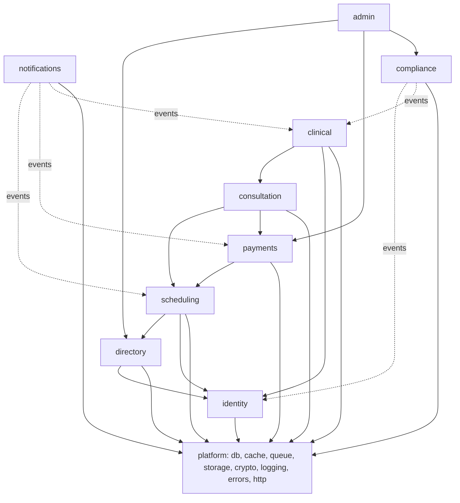
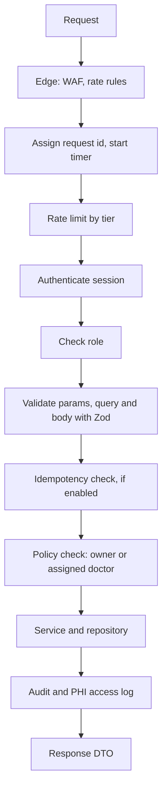
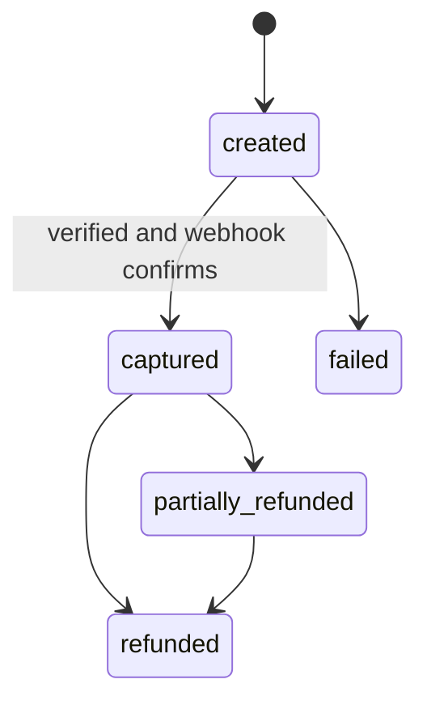

# ViniCure backend architecture

Status: planning baseline v1, 2 October 2026
Read first: `architecture.md`. Data model: `er_model.md`. Tasks: `../TODO.md`.

This document is the build contract for everything under `src/server`, `src/worker`, `src/app/api` and `db/`. Values marked "proposal" are starting points to confirm during the build.

## Contents

1. [Style and module map](#1-style-and-module-map)
2. [Request pipeline and `withApi()`](#2-request-pipeline-and-withapi)
3. [Authentication and sessions](#3-authentication-and-sessions)
4. [Authorization policies](#4-authorization-policies)
5. [API conventions](#5-api-conventions)
6. [API catalogue](#6-api-catalogue)
7. [Data access](#7-data-access)
8. [Jobs and schedules](#8-jobs-and-schedules)
9. [Adapters](#9-adapters)
10. [Payments design](#10-payments-design)
11. [Video design](#11-video-design)
12. [Files and uploads](#12-files-and-uploads)
13. [Security controls and OWASP mapping](#13-security-controls-and-owasp-mapping)
14. [Audit and PHI access logging](#14-audit-and-phi-access-logging)
15. [Logging, metrics and alerts](#15-logging-metrics-and-alerts)
16. [Testing strategy](#16-testing-strategy)
17. [Configuration catalogue](#17-configuration-catalogue)
18. [Performance rules](#18-performance-rules)
19. [Migration rules](#19-migration-rules)
20. [Not verified](#20-not-verified)

---

## 1. Style and module map

A modular monolith. One codebase, two processes from one image: `web` (Next.js UI and API) and `worker` (background jobs). Modules talk through services and events, never through each other's tables.



Each module folder contains:

```
modules/<name>/
  schemas.ts      Zod schemas (request, response, domain)
  policy.ts       who may do what (pure functions)
  service.ts      business rules, transactions, events
  repo.ts         the only file that queries the database
  events.ts       events it emits
  index.ts        public surface used by other modules
```

Rules:
- Route handlers parse input, call one service function and return a response DTO.
- Services never import `repo.ts` from other modules.
- Response DTOs are explicit allow-lists. Database rows are never returned directly.

---

## 2. Request pipeline and `withApi()`



Contract (TypeScript sketch, adjust names during build):

```ts
export const POST = withApi(
  {
    auth: "session",              // "public" | "session" | "staff"
    roles: ["patient"],           // checked after authentication
    rateLimit: "write",           // tier name, see section 5
    body: BookAppointmentSchema,  // Zod, unknown fields rejected
    idempotent: true,             // requires Idempotency-Key header
    audit: { action: "appointment.hold", entity: "appointment" },
  },
  async ({ body, actor, requestId }) => {
    // call one service function, return a DTO
  },
);
```

`withApi()` guarantees:
- A request ID on every response and log line.
- Rate limiting. Sensitive tiers (OTP, sign-in, payments, admin) fail closed if the cache is unreachable in production. Public read tiers fail open with an alert, so a cache outage does not take the site down. Hits are logged as security events and counted in metrics.
- Errors converted to one error shape (section 5).
- No request body or secret ever logged.
- A registry entry for each route. A test fails if a route file does not use it, or if it is missing from the access-control matrix.

---

## 3. Authentication and sessions

Library: Better Auth, self-hosted, storing users and sessions in our Postgres. Wrap it in `modules/identity` so the rest of the code never imports it.

| Who | Method | Notes |
|---|---|---|
| Patient | Phone number plus OTP (the phone plugin with `signUpOnVerification`, so first sign-in creates the account) | OTP sender is our MSG91 adapter. E.164 format. Only +91 allowed by config (proposal). Optional email. |
| Doctor, admin, support | Email, password and TOTP | Created by invitation. Two-factor is mandatory. Backup codes at enrolment. |

Important rule: Better Auth's two-factor step applies to credential sign-in endpoints, not to passwordless sign-in. So staff accounts must be blocked from phone-only sign-in in our code, and a test must prove it.

Session rules (proposals):
- Cookie: HttpOnly, Secure, SameSite=Lax, `__Host-` prefix.
- Patient sessions up to 14 days idle. Staff sessions 8 hours.
- Sensitive actions (refund, role change, break-glass, data erase) require a fresh login within 15 minutes.
- Users can list and revoke their own sessions. "Sign out everywhere" revokes all.
- Origin check on every mutating request, in addition to SameSite.
- Account linking between different identities is off unless explicitly designed.
- Staff passwords: Argon2id if the auth library supports it, otherwise bcrypt or scrypt with OWASP-recommended parameters (confirm in P2-15). Failed attempts back off and then lock the account temporarily. Changing or resetting a password invalidates other sessions.
- Suspicious sign-in patterns (many failures, new device, unusual location) alert the user and admins (P9-12).

OTP abuse controls (SMS cost abuse is a business-flow risk):
- Captcha token required on OTP send (hCaptcha, already used in ViniCare).
- Limits: 3 sends per 10 minutes per phone, 10 per hour per IP, and a global daily SMS budget cap with an alert.
- Each code allows 5 attempts and then dies. Target: codes stored as hashes with a 10-minute lifetime, in Valkey if the phone plugin allows custom storage, otherwise in `auth_verifications` (hashed, short lifetime). Confirm in P2-03.

Doctor onboarding: public application form (captcha) creates a `doctors` row with status `pending` and no user. Admin reviews KYC, then sends an invitation. Accepting the invitation creates the user, sets the password and forces TOTP enrolment.

---

## 4. Authorization policies

Authentication says who you are. Policies say what you may touch. Policies are pure functions in each module's `policy.ts`, with unit tests.

| Resource | Patient owner | Assigned doctor | Other doctor | Admin | Support |
|---|---|---|---|---|---|
| Patient profile | read, write | read | none | read basic | break-glass |
| Appointment | read, cancel, reschedule | read, update status | none | read | read |
| Join consultation | yes, if paid and in window | yes, if assigned | none | none | none |
| Clinical notes | none | read, write | none | none | break-glass |
| Prescriptions | read | read, write | none | none | break-glass |
| Vitals, conditions | read, write | read, write | none | none | break-glass |
| Uploaded documents | read, write | read | none | none | break-glass |
| Payments and invoices | read own | read earnings only | none | read, refund | read |
| KYC documents | none | upload own | none | read, review | none |
| Audit log and PHI access log | none | none | none | read | read |

"Assigned doctor" means the doctor has an appointment with that patient in a status that allows access (scheduled, in progress, completed). Every clinical read by a doctor is written to the PHI access log with purpose `treatment`.

Break-glass: a support user enters a reason, gets time-limited access (proposal: 30 minutes), every read is logged, and an alert goes to the admin channel.

Unauthorized access to an object the caller does not own returns 404, not 403, to avoid revealing which IDs exist.

---

## 5. API conventions

- Base path `/api/v1`. Better Auth lives under `/api/auth/*`. The Razorpay webhook lives at `/api/webhooks/razorpay`.
- JSON in and out. Dates in ISO 8601 UTC. Money as integer paise.
- OpenAPI document generated from the Zod schemas. CI fails if a route is undocumented.
- Pagination: cursor-based with `limit` (max 100) and `cursor`.
- Headers: `X-Request-Id` on every response. `Idempotency-Key` on booking and payment writes. Standard rate-limit headers on 429.

Error shape (problem-details style):

```json
{
  "type": "https://vinicure.example/errors/slot-taken",
  "title": "Slot taken",
  "status": 409,
  "code": "slot_taken",
  "detail": "That slot was just booked.",
  "requestId": "01J..."
}
```

Common codes: `unauthenticated`, `forbidden`, `not_found`, `validation_failed`, `rate_limited`, `slot_taken`, `payment_signature_invalid`, `consent_required`, `outside_join_window`, `idempotency_conflict`, `file_rejected`.

Idempotency: the key and a hash of the request are stored for 24 hours (Valkey for speed, Postgres as record). Same key and same request returns the stored response. Same key with a different request returns 422.

Rate-limit tiers (proposals):

| Tier | Limit |
|---|---|
| `public_read` | 120 per minute per IP |
| `auth_read` | 300 per minute per user |
| `write` | 60 per minute per user |
| `otp_send` | 3 per 10 minutes per phone, 10 per hour per IP, daily global cap |
| `otp_verify` | 5 attempts per code, 10 per 10 minutes per phone |
| `payments` | 10 per minute per user |
| `ai` | 5 per hour per user, plus a daily budget |
| `admin` | 120 per minute per user |

---

## 6. API catalogue

Auth column: `public`, `session` (any signed-in user), `patient`, `doctor`, `staff`, `admin`, `support`, `signature` (webhook). "Owner" means the policy checks ownership.

### identity

| Method | Path | Auth | Notes |
|---|---|---|---|
| GET | `/api/v1/me` | session | Profile and roles |
| GET, POST | `/api/v1/patients` | patient | List and create family profiles |
| GET, PATCH, DELETE | `/api/v1/patients/:id` | patient, owner | Delete is a soft delete |
| GET, DELETE | `/api/v1/sessions`, `/api/v1/sessions/:id` | session | Own sessions only |
| POST | `/api/v1/admin/invitations` | admin | Invite doctor or staff |
| POST | `/api/v1/invitations/:token/accept` | public (token) | Set password, enrol TOTP |
| POST | `/api/v1/staff/password-reset/request` | public | 3 per 15 minutes per IP. Same response whether or not the email exists. |
| POST | `/api/v1/staff/password-reset/confirm` | public (token) | Single-use token. Invalidates other sessions. |

### directory

| Method | Path | Auth | Notes |
|---|---|---|---|
| GET | `/api/v1/specialties` | public | Cached |
| GET | `/api/v1/doctors` | public | Cached, filters. Shows registration number and qualifications. |
| GET | `/api/v1/doctors/:id` | public | |
| GET | `/api/v1/doctors/:id/slots` | public | Query `date`. Short cache. |
| POST | `/api/v1/doctor-applications` | public | Captcha. Creates a pending doctor. |
| GET, PATCH | `/api/v1/doctor/profile` | doctor | |
| GET, PUT | `/api/v1/doctor/availability` | doctor | Weekly rules |
| POST, DELETE | `/api/v1/doctor/time-off` | doctor | |
| POST | `/api/v1/doctor/kyc/uploads` | doctor | Presign |
| POST | `/api/v1/doctor/kyc/uploads/:id/complete` | doctor | Starts scan |
| GET | `/api/v1/admin/doctors` | admin | Filter by status |
| POST | `/api/v1/admin/doctors/:id/approve`, `/reject`, `/suspend` | admin | Audited |
| GET | `/api/v1/admin/doctors/:id/kyc/:fileId` | admin | Short signed URL, logged |

### scheduling

| Method | Path | Auth | Notes |
|---|---|---|---|
| POST | `/api/v1/appointments` | patient | Holds a slot. Idempotent. |
| GET | `/api/v1/appointments` | patient, doctor | Own only. Cursor pagination. |
| GET | `/api/v1/appointments/:id` | owner or assigned doctor | |
| POST | `/api/v1/appointments/:id/cancel` | owner or assigned doctor | Refund rules apply |
| POST | `/api/v1/appointments/:id/reschedule` | patient, owner | |
| GET | `/api/v1/doctor/appointments` | doctor | Today and upcoming |

### payments

| Method | Path | Auth | Notes |
|---|---|---|---|
| POST | `/api/v1/payments/orders` | patient | Amount from the appointment fee. Idempotent. |
| POST | `/api/v1/payments/verify` | patient, owner | Verifies checkout signature |
| POST | `/api/webhooks/razorpay` | signature | Raw body verified. Deduplicated. |
| GET | `/api/v1/payments/:id/invoice` | owner | Short signed URL |
| POST | `/api/v1/admin/refunds` | admin | Fresh login required |
| GET | `/api/v1/doctor/earnings` | doctor | |
| GET | `/api/v1/admin/revenue` | admin | |

### consultation

| Method | Path | Auth | Notes |
|---|---|---|---|
| POST | `/api/v1/consultations/:appointmentId/join` | patient or doctor | Checks payment, window, consent, assignment |
| POST | `/api/v1/consultations/:id/token` | participant | Renewal. Denied after end. |
| POST | `/api/v1/consultations/:id/end` | doctor | |
| GET | `/api/v1/consultations/:id` | participant | |

### clinical

| Method | Path | Auth | Notes |
|---|---|---|---|
| GET, POST | `/api/v1/appointments/:id/notes` | doctor, assigned | Versioned, encrypted |
| POST | `/api/v1/appointments/:id/prescriptions` | doctor, assigned | |
| GET | `/api/v1/prescriptions/:id` | owner or assigned doctor | PHI access logged |
| GET | `/api/v1/prescriptions/:id/download` | owner or assigned doctor | Short signed URL |
| POST | `/api/v1/prescriptions/:id/revoke` | doctor, author | Reason required |
| GET | `/api/v1/rx/verify/:token` | public | Shows validity only, no clinical content |
| GET, POST | `/api/v1/patients/:id/vitals` | owner or assigned doctor | |
| GET, POST, PATCH | `/api/v1/patients/:id/conditions` | owner or assigned doctor | |
| POST | `/api/v1/patients/:id/documents/uploads` | owner | Presign |
| POST | `/api/v1/patients/:id/documents/uploads/:uploadId/complete` | owner | Starts scan |
| GET | `/api/v1/patients/:id/documents`, `/documents/:docId/download` | owner or assigned doctor | |
| DELETE | `/api/v1/patients/:id/documents/:docId` | owner | Soft delete |
| POST | `/api/v1/appointments/:id/follow-ups` | doctor, assigned | |
| POST | `/api/v1/ai/triage` | patient | Feature flag, consent, redaction, budget |

### compliance

| Method | Path | Auth | Notes |
|---|---|---|---|
| GET | `/api/v1/consents/policies` | public | Current versions |
| POST | `/api/v1/consents` | session | Records agreement |
| DELETE | `/api/v1/consents/:id` | session, owner | Withdrawal |
| POST, GET | `/api/v1/data-requests` | session | Export, erase, correct |
| GET | `/api/v1/admin/audit-logs`, `/api/v1/admin/phi-access-logs` | admin, support | |
| POST | `/api/v1/support/break-glass` | support | Reason, time-limited |
| GET, POST, PATCH | `/api/v1/admin/incidents` | admin | |
| GET, POST | `/api/v1/admin/data-requests` | admin | Process requests |
| GET | `/api/v1/admin/exports/:type` | admin | CSV of revenue, appointments or refunds. Audited, rate limited, no clinical content. |

### engagement and platform

| Method | Path | Auth | Notes |
|---|---|---|---|
| POST | `/api/v1/appointments/:id/review` | patient, owner | After completion |
| GET | `/api/v1/doctors/:id/reviews` | public | Published only |
| POST, DELETE | `/api/v1/favorites` | patient | |
| POST | `/api/v1/newsletter/subscribe` | public | Captcha |
| GET | `/api/v1/newsletter/unsubscribe` | public (token) | |
| GET | `/api/health` | public | Liveness, no writes |
| GET | `/api/ready` | public | Database and cache ping |

About 75 endpoints. Every one is listed in the OpenAPI document and the access-control matrix test.

---

## 7. Data access

- Drizzle for typed queries. SQL migrations are the source of truth (section 19).
- Postgres roles: `migrator` (DDL, used only in the migrate step), `app` (DML only), later a `reporting` read-only role. `app` has no UPDATE or DELETE on append-only tables.
- Transactions: one transaction per service call that writes more than one table. Business events are queued after commit.
- Pool: size set per task so that tasks times pool stays under the database connection limit. Add RDS Proxy only when connection counts demand it.
- Row-level security as a second lock is a later hardening task, after the first release.
- Free-text clinical fields use the crypto module (envelope encryption). Repositories encrypt and decrypt, so services never see ciphertext.

Crypto module contract:
- Value format includes a key ID: `v1:{keyId}:{iv}:{tag}:{ciphertext}`.
- Data keys are wrapped by KMS in AWS. A local key provider is used in development.
- A rotation job re-encrypts rows to the newest key without downtime.
- Tests: tamper detection, wrong key, rotation, and old-value decryption.

---

## 8. Jobs and schedules

pg-boss runs in the worker process on the same Postgres, in its own schema. Producers (web and worker) enqueue. Only the worker consumes.

| Queue or schedule | Trigger | Purpose | Retries |
|---|---|---|---|
| `otp.send` | OTP request | Send OTP SMS | 3, short backoff |
| `notify.send` | Event | Send one SMS, WhatsApp or email | 5, exponential |
| `reminder.fire` | Delayed at confirm (24 hours and 1 hour before) | Send reminders. Cancelled or moved when the appointment changes. | 5 |
| `appointment.release_holds` | Cron every minute | Expire unpaid holds | n/a |
| `payment.webhook.process` | Webhook | Apply events in order, idempotent | 10 |
| `payment.reconcile` | Cron daily | Compare with Razorpay, flag mismatches | 3 |
| `file.scan` | Upload complete | ClamAV scan, then activate or reject | 5 |
| `prescription.render_pdf`, `invoice.render_pdf` | Issue or capture | Render and store PDF | 5 |
| `export.build` | Data request | Build and store export archive | 3 |
| `erasure.run` | Approved request | Anonymize per rules | 3 |
| `retention.purge` | Cron daily | Purge expired exports and recordings | 3 |
| `audit.partition` | Cron monthly | Create next audit partitions | 3 |
| `crypto.reencrypt` | Manual | Rotate encryption keys | 3 |

Every queue has a dead-letter queue and an alert on its depth. Handlers must be idempotent.

Never send notifications inside the request. Always enqueue.

---

## 9. Adapters

Each adapter has a real implementation and a fake used in tests and local development. Services depend on the interface only.

```ts
interface VideoProvider {
  createRoom(): Promise<{ roomRef: string }>;
  issueToken(i: { roomRef: string; uid: number; role: "host" | "audience"; ttlSeconds: number }):
    Promise<{ token: string; expiresAt: Date }>;
  startRecording?(roomRef: string): Promise<{ recordingRef: string }>;
  stopRecording?(recordingRef: string): Promise<void>;
}

interface PaymentProvider {
  createOrder(i: { amountPaise: number; currency: "INR"; receipt: string; notes?: Record<string, string> }):
    Promise<{ orderId: string }>;
  verifyCheckoutSignature(i: { orderId: string; paymentId: string; signature: string }): boolean;
  verifyWebhook(i: { rawBody: string; signature: string }): boolean;
  fetchPayment(paymentId: string): Promise<{ status: string; amountPaise: number; orderId: string }>;
  refund(i: { paymentId: string; amountPaise: number; reason: string }): Promise<{ refundId: string }>;
}

interface SmsProvider { sendTemplate(i: { to: string; templateKey: string; variables: Record<string, string> }): Promise<{ providerId: string }>; }
interface WhatsAppProvider { sendTemplate(i: { to: string; templateName: string; language: string; variables: Record<string, string> }): Promise<{ providerId: string }>; }
interface EmailProvider { send(i: { to: string; templateKey: string; variables: Record<string, string> }): Promise<{ providerId: string }>; }
interface FileScanner { scan(i: { storageKey: string }): Promise<{ status: "clean" | "infected" | "error" }>; }
interface AiProvider { triage(i: { redactedText: string; locale: string }): Promise<{ suggestedSpecialties: string[]; disclaimer: string }>; }
```

Rules:
- No patient names, phone numbers or clinical text go into notification variables unless the template is approved for it. Prefer a link that requires sign-in.
- Adapter calls have timeouts, retries where safe, and never log request bodies.
- The AI adapter receives redacted text only, and only after consent. The output is advisory. The system never creates a prescription from it.

---

## 10. Payments design

Follows Razorpay's documented flow: create an order on the server for every attempt, verify the signature on the server before fulfilling, and use webhooks as the safety net.



Rules:
- The amount comes from `appointments.fee_paise`, which the server copied from the doctor's fee at hold time. The client never sends an amount.
- A fresh order per payment attempt. Never reuse an order for a different amount.
- Checkout signature verified before any state change. Webhook verified against the raw request body before parsing.
- Webhook events are stored once (unique event ID). Replays are acknowledged and ignored. Out-of-order events are handled by state rules, not arrival order.
- Fulfil only when the payment status is `captured`.
- Late payment: if the hold has expired and the slot is taken, refund automatically and notify. If the slot is free, confirm it.
- Ledger is append-only. Each capture writes doctor share and platform fee entries (`doctors.platform_fee_bps`). Refunds write reversals.
- Daily reconciliation compares our records with Razorpay and raises an alert on any difference.
- Invoice numbers are sequential per financial year. Tax treatment: HUMAN accountant to confirm.

---

## 11. Video design

- **Channel name:** random value generated per consultation and stored in `consultations.provider_room_ref`. Not derived from the appointment ID.
- **UID:** one numeric UID per participant per consultation, stored in `consultation_participants.provider_uid`. The token is built for that UID and channel only.
- **Token lifetime:** 1 hour. The client asks for a new token when the SDK warns that the token will expire. Renewal is denied once the consultation has ended or the participant was revoked.
- **Join checks:** appointment is scheduled or in progress, payment captured, within the join window (config, proposal: 10 minutes before start to 90 minutes after), video consent on record, and the caller is the patient owner or the assigned doctor.
- **Recording:** off by default (feature flag). Requires recording consent from both parties. Stored in the Mumbai bucket. Retention job deletes after the configured period (HUMAN legal).
- **Failure handling:** reconnect logic, audio-only fallback, and a "problem joining" link that notifies support.
- **Pilot:** keep `VideoProvider` swappable and compare Agora with one alternative on real Indian mobile networks before launch.

---

## 12. Files and uploads

All files (KYC documents, patient documents, prescription PDFs, invoices, recordings, exports) are rows in `files` with a storage key, size, hash and scan status.

Upload flow:
1. Client asks for an upload slot. Server checks policy, size and type limits, then returns a presigned PUT URL valid for a few minutes.
2. Client uploads directly to S3.
3. Client calls `complete`. Server verifies the object exists, checks size and magic bytes, sets `scan_status = pending` and queues `file.scan`.
4. Worker scans with ClamAV. `clean` activates the file. `infected` or `error` rejects it and deletes the object.
5. Downloads use signed URLs of a few minutes and write a PHI access log entry for clinical files.

Limits (proposals): documents 20 MB, images 10 MB, exports and recordings by purpose. Allowed types are an explicit list per purpose.

Test the scanner with the standard EICAR test string.

---

## 13. Security controls and OWASP mapping

OWASP API Security Top 10 (2023):

| Risk | Control in this design | Test |
|---|---|---|
| API1 Broken object-level authorization | Policy functions on every object access. 404 for objects not owned. | Access-control matrix covering every route and role |
| API2 Broken authentication | Better Auth, staff TOTP, short staff sessions, fresh login for sensitive actions, OTP limits | Staff cannot sign in by phone alone. Brute-force and replay tests. |
| API3 Broken object-property-level authorization | Response DTO allow-lists. Strict input schemas that reject unknown fields. | Mass-assignment and over-exposure tests |
| API4 Unrestricted resource consumption | Tiered rate limits, body and file size limits, AI budget, SMS budget | Load and limit tests |
| API5 Broken function-level authorization | Role check in `withApi()` plus policy | Role-escalation tests on every admin and staff route |
| API6 Unrestricted access to sensitive business flows | OTP caps and captcha, slot hold timeout, referral caps, idempotency | Abuse-scenario tests |
| API7 Server-side request forgery | No user-supplied URLs fetched. Patched framework. | Dependency gate |
| API8 Security misconfiguration | Headers, boot-time config validation, IaC review, no public data stores | Header snapshot test, config tests |
| API9 Improper inventory management | OpenAPI generated from code. Route registry. | CI fails on undocumented routes |
| API10 Unsafe consumption of APIs | Validate every third-party response. Advisory-only AI and drug data. | Contract tests with fakes |

Other controls:
- **CSRF and origin:** SameSite cookies plus an Origin check on mutating requests.
- **CORS:** same origin only. No wildcard.
- **Headers:** set in `src/proxy.ts` (CSP with nonce, HSTS, frame-ancestors none, referrer policy, permissions policy). Do not rely on the proxy alone for authorization. Every route checks for itself.
- **Secrets:** Secrets Manager in AWS. A Zod schema validates required variables at boot.
- **Dependencies:** lockfile, `pnpm audit` as a CI gate, Dependabot, secret scanning, container scan. Monthly Next.js patch day and an emergency path for critical advisories.
- **Webhooks:** signature required, body size cap, replay safe.
- **Break-glass and admin power:** logged, time-limited, alerted.

---

## 14. Audit and PHI access logging

Two append-only streams.

**Audit log** (`audit_logs`): who did what to which entity, when, from where. Written for every mutation and every sensitive read through `withApi({ audit })`. Metadata holds IDs and changed field names, never values.

**PHI access log** (`phi_access_logs`): every read of clinical content (notes, prescriptions, vitals, conditions, documents, recordings) with actor, patient, resource, and purpose (`treatment`, `patient_self`, `support_break_glass`, `legal`).

Rules:
- The `app` role has INSERT only. No UPDATE or DELETE.
- `audit_logs` is partitioned by month. A job creates future partitions.
- Online retention at least 180 days (CERT-In). Longer retention: HUMAN decision.
- Later option: a hash chain over entries for tamper evidence.
- Patients can see who accessed their records (optional screen).

---

## 15. Logging, metrics and alerts

- pino JSON logs. Fields: time, level, requestId, route, method, status, durationMs, userId (internal ID only), module. Bodies never logged.
- Redaction list: phone, email, name, address, tokens, Authorization and Cookie headers, OTP, any field ending in `_enc`.
- Sentry gets the same redaction. No patient data is sent.
- Metrics (rate, errors, duration) per route and queue. Dashboards in CloudWatch.
- Alerts: 5xx rate, 95th percentile latency, database CPU and connections, queue depth and dead letters, payment webhook failures, OTP send spikes, certificate expiry, backup failure, break-glass use.

---

## 16. Testing strategy

| Layer | Tool | What it proves |
|---|---|---|
| Unit | Vitest | Policies, state machines, crypto, validators |
| Access-control matrix | Vitest, real database | For every route, every role: allowed or denied as the table in section 4 says. Test fails if a route is missing. |
| Integration | Vitest with real Postgres and Valkey (compose or containers) | Services with real constraints. Concurrent booking: exactly one wins. |
| Contract | Vitest | Each adapter fake and real implementation honor the same interface |
| Webhooks | Vitest | Replay, out-of-order, bad signature, tampered amount |
| End to end | Playwright | Sign in, book, pay (test mode), join, prescribe, download |
| Accessibility | axe inside Playwright | No serious violations on key pages |
| Load | k6 | Directory, booking, OTP, within targets |
| Security | CI scans plus manual review before launch | Dependencies, secrets, images, OWASP list |

CI gates: lint, types, all tests above except load, `pnpm audit`, secret scan, image scan, migrations apply on an empty database.

---

## 17. Configuration catalogue

Names only. Never commit values. A Zod schema validates these at boot and the app refuses to start in production if a required one is missing.

| Group | Variables |
|---|---|
| App | `NODE_ENV`, `APP_URL`, `APP_ENV` (local, staging, production), `LOG_LEVEL` |
| Database | `DATABASE_URL` (app role), `DATABASE_MIGRATION_URL` (migrator role), `DATABASE_POOL_MAX` |
| Cache | `VALKEY_URL`, `VALKEY_TLS` |
| Auth | `AUTH_SECRET`, `AUTH_TRUSTED_ORIGINS`, `ALLOWED_PHONE_COUNTRY_CODES` |
| Crypto | `CRYPTO_PROVIDER` (local or kms), `KMS_KEY_ID`, `LOCAL_DEV_KEY` (dev only) |
| Storage | `S3_BUCKET_FILES`, `S3_BUCKET_EXPORTS`, `S3_REGION`, `S3_ENDPOINT` (MinIO in dev), `SIGNED_URL_TTL_SECONDS` |
| Video | `AGORA_APP_ID`, `AGORA_APP_CERTIFICATE`, `VIDEO_TOKEN_TTL_SECONDS`, `VIDEO_JOIN_EARLY_MINUTES`, `VIDEO_JOIN_LATE_MINUTES` |
| Payments | `RAZORPAY_KEY_ID`, `RAZORPAY_KEY_SECRET`, `RAZORPAY_WEBHOOK_SECRET` |
| SMS | `MSG91_AUTH_KEY`, `MSG91_SENDER_ID`, template IDs per `templateKey` |
| WhatsApp | `WHATSAPP_TOKEN`, `WHATSAPP_PHONE_NUMBER_ID`, template names |
| Email | `SES_REGION`, `EMAIL_FROM` (Mailpit host in dev) |
| Scanner | `CLAMAV_HOST`, `CLAMAV_PORT` |
| Captcha | `HCAPTCHA_SITE_KEY`, `HCAPTCHA_SECRET` |
| AI | `FEATURE_AI_TRIAGE`, `AI_API_KEY`, `AI_MODEL`, `AI_DAILY_BUDGET` |
| Flags | `FEATURE_RECORDING`, `FEATURE_REFERRALS` |
| Monitoring | `SENTRY_DSN`, `SENTRY_ENVIRONMENT` |
| Budgets | `SMS_DAILY_CAP` |

---

## 18. Performance rules

- Every query used by a route has an index. Review `EXPLAIN` for list and slot queries before release.
- No queries in loops. List endpoints use joins or batched queries.
- Cursor pagination only. No unbounded lists.
- Cache only public, non-personal data: doctor list (about 60 seconds), specialties (longer), slots (about 15 seconds). Invalidate on change.
- Notifications, PDFs, exports and scans always run in the worker.
- Response DTOs stay small. No clinical text on list endpoints.
- Connection pool sized per task. Reuse clients (database, cache, S3) across requests.

---

## 19. Migration rules

- Forward-only numbered SQL files in `db/migrations`, reviewed in pull requests. Never edit an applied migration.
- A `migrate` step runs with the `migrator` role before each deploy. The app role cannot change the schema.
- Zero-downtime pattern: expand (add columns or tables), deploy code that handles both, backfill, then contract in a later release.
- CI applies all migrations to an empty database and fails on error.
- Constraints that Drizzle cannot express (exclusion constraint, partitions, grants, triggers) live in hand-written SQL files.
- Seed data (roles, specialties, consent policies) is in `db/seeds`, safe to re-run.

---

## 20. Not verified

- Better Auth behaviors listed here come from its documentation. Confirm each in the matching task, especially staff sign-in blocking, session lifetime options and OTP sender wiring.
- Rate limits, session lifetimes, join windows, break-glass duration and file limits are proposals.
- Whether Drizzle migration tooling cleanly coexists with hand-written SQL files. Confirm in P1-02.
- Legal items: retention periods, erasure versus retention, drug restriction lists, recording retention, invoice tax treatment.
