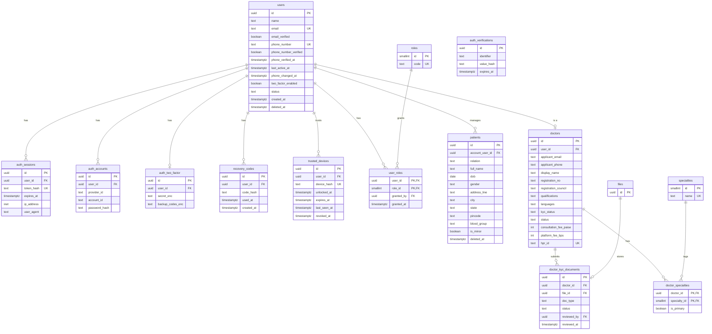
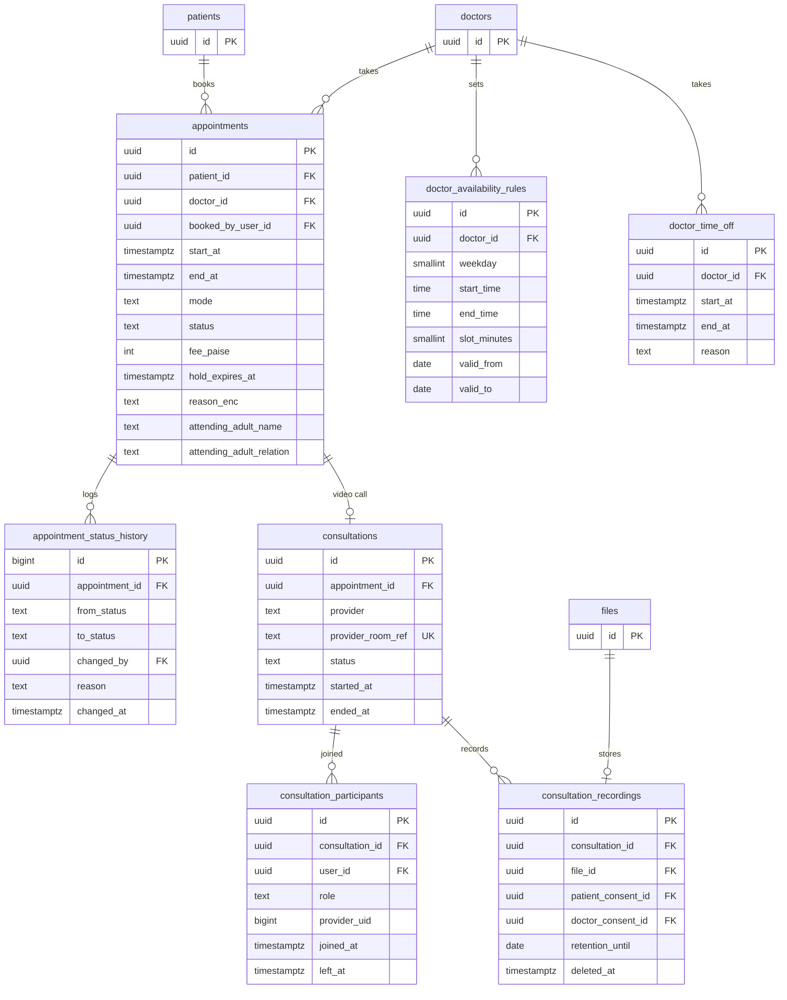
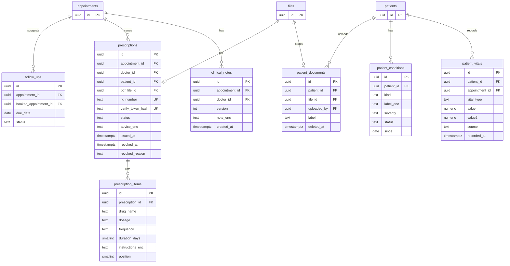
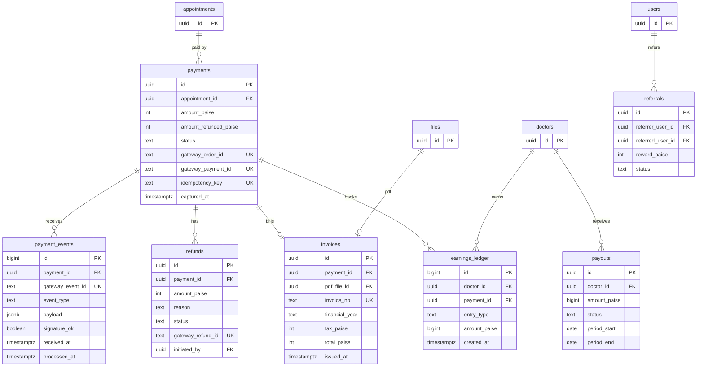
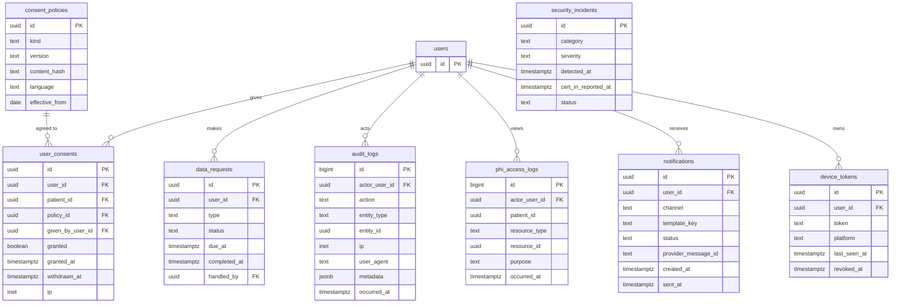
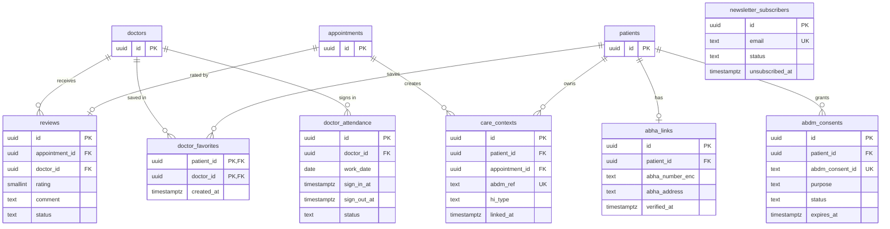
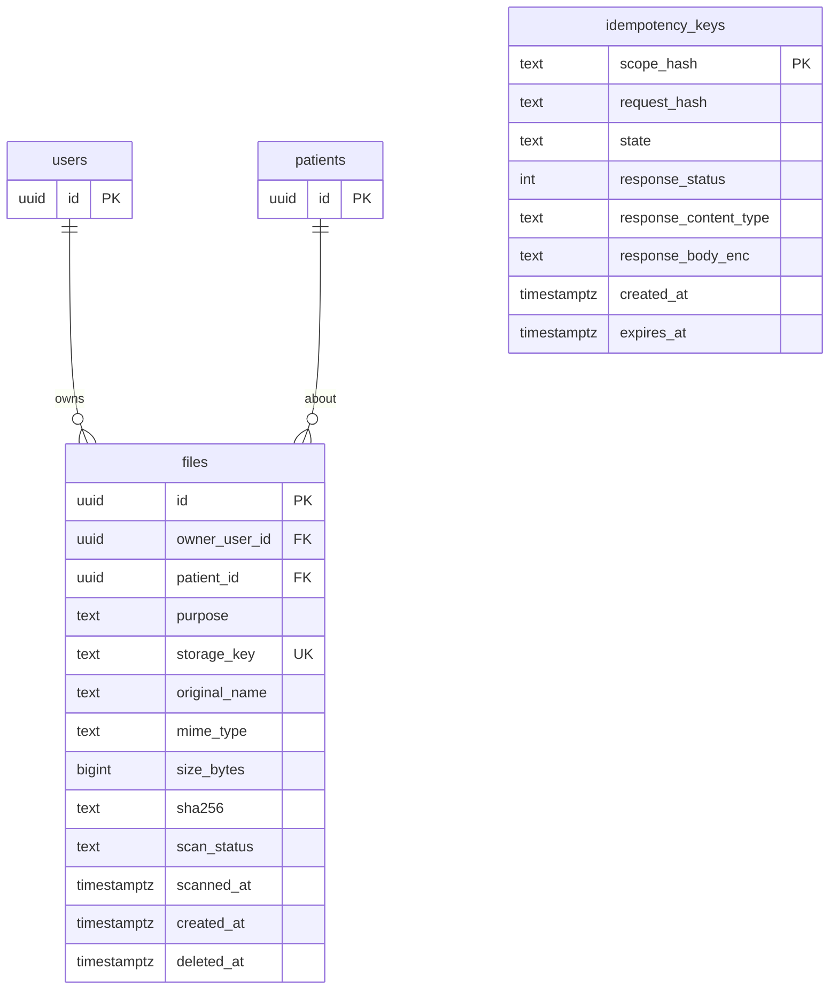

# ViniCure data model

Status: planning baseline v1, 2 October 2026
Database: PostgreSQL. 53 tables in seven parts, plus pg-boss's own `pgboss` schema for jobs.
Read with: `architecture.md`, `backend-architecture.md`, `../TODO.md`.

The model is built from the ViniCare review. Differences from ViniCare's Firestore collections are listed in section 8.

Diagrams use Mermaid. In each diagram, a table that shows only an `id` is a reference stub. Its full definition is in the part where it belongs.

## Contents

1. [Master table list](#1-master-table-list)
2. [Part 1: identity and people](#2-part-1-identity-and-people)
3. [Part 2: scheduling and video consultation](#3-part-2-scheduling-and-video-consultation)
4. [Part 3: clinical records](#4-part-3-clinical-records)
5. [Part 4: payments and money](#5-part-4-payments-and-money)
6. [Part 5: consent, audit and notifications](#6-part-5-consent-audit-and-notifications)
7. [Part 6: engagement, attendance and ABDM](#7-part-6-engagement-attendance-and-abdm)
8. [Part 7: platform](#8-part-7-platform)
9. [Rules for every table](#9-rules-for-every-table)
10. [Status values](#10-status-values)
11. [Constraints, indexes and grants](#11-constraints-indexes-and-grants)
12. [Encryption matrix](#12-encryption-matrix)
13. [Retention matrix](#13-retention-matrix)
14. [Migration order and seeds](#14-migration-order-and-seeds)
15. [Mapping from ViniCare](#15-mapping-from-vinicare)
16. [Not verified](#16-not-verified)

---

## 1. Master table list

Phase: **MVP** is the first release. **Later** is after launch or behind a flag.

| # | Table | Part | Phase | Purpose |
|---|---|---|---|---|
| 1 | `users` | 1 | MVP | Login accounts (Better Auth user table, renamed) |
| 2 | `auth_sessions` | 1 | MVP | Active sessions |
| 3 | `auth_accounts` | 1 | MVP | Credentials (staff password hash) |
| 4 | `auth_verifications` | 1 | MVP | Short-lived verification records |
| 5 | `auth_two_factor` | 1 | MVP | Staff TOTP secret and backup codes |
| 6 | `roles` | 1 | MVP | patient, doctor, admin, super_admin, support |
| 7 | `user_roles` | 1 | MVP | Which user holds which role |
| 8 | `patients` | 1 | MVP | Patient profiles; one account can manage several |
| 9 | `doctors` | 1 | MVP | Doctor profiles, registration number, fees |
| 10 | `doctor_kyc_documents` | 1 | MVP | KYC files and review status |
| 11 | `specialties` | 1 | MVP | Medical specialties |
| 12 | `doctor_specialties` | 1 | MVP | Doctor to specialty link |
| 13 | `appointments` | 2 | MVP | Bookings, including held slots |
| 14 | `appointment_status_history` | 2 | MVP | Every status change |
| 15 | `doctor_availability_rules` | 2 | MVP | Weekly working hours and slot length |
| 16 | `doctor_time_off` | 2 | MVP | Leave and blocked periods |
| 17 | `consultations` | 2 | MVP | Video sessions |
| 18 | `consultation_participants` | 2 | MVP | Who joined, with provider UID |
| 19 | `consultation_recordings` | 2 | Later (flag) | Recordings with consents and retention |
| 20 | `clinical_notes` | 3 | MVP | Versioned encrypted notes |
| 21 | `prescriptions` | 3 | MVP | Issued prescriptions |
| 22 | `prescription_items` | 3 | MVP | Medicines in a prescription |
| 23 | `follow_ups` | 3 | MVP | Suggested and booked follow-ups |
| 24 | `patient_vitals` | 3 | MVP | BP, pulse, SpO2, temperature, weight, glucose |
| 25 | `patient_conditions` | 3 | MVP | Conditions, allergies, medications, surgeries |
| 26 | `patient_documents` | 3 | MVP | Uploaded reports |
| 27 | `payments` | 4 | MVP | Payment attempts |
| 28 | `payment_events` | 4 | MVP | Stored webhooks, deduplicated |
| 29 | `refunds` | 4 | MVP | Refunds |
| 30 | `invoices` | 4 | MVP | Invoices with sequential numbers |
| 31 | `earnings_ledger` | 4 | MVP | Append-only doctor earnings |
| 32 | `payouts` | 4 | Later | Settlements to doctors |
| 33 | `referrals` | 4 | Later (flag) | Referral rewards |
| 34 | `consent_policies` | 5 | MVP | Versioned consent and policy texts |
| 35 | `user_consents` | 5 | MVP | Who agreed to what |
| 36 | `data_requests` | 5 | MVP | Export, erase, correct requests |
| 37 | `audit_logs` | 5 | MVP | Append-only action log, partitioned |
| 38 | `phi_access_logs` | 5 | MVP | Who viewed which patient's data |
| 39 | `security_incidents` | 5 | MVP | Incident register for CERT-In |
| 40 | `notifications` | 5 | MVP | SMS, WhatsApp, email outbox |
| 41 | `device_tokens` | 5 | Later | Push tokens |
| 42 | `reviews` | 6 | MVP | Ratings of doctors |
| 43 | `doctor_favorites` | 6 | MVP | Saved doctors |
| 44 | `doctor_attendance` | 6 | Later (if needed) | Doctor sign-in and sign-out |
| 45 | `newsletter_subscribers` | 6 | Later | Email subscribers |
| 46 | `abha_links` | 6 | Later (ABDM) | ABHA number (encrypted) |
| 47 | `care_contexts` | 6 | Later (ABDM) | Records linked to ABDM |
| 48 | `abdm_consents` | 6 | Later (ABDM) | ABDM consent artefacts |
| 49 | `files` | 7 | MVP | Registry of every stored file |
| 50 | `idempotency_keys` | 7 | MVP | Safe retries for writes |
| 51 | `recovery_codes` | 1 | MVP | Single-use account recovery codes (hashed) |
| 52 | `trusted_devices` | 1 | MVP | Devices unlocked with a second method, for risk-based sign-in |
| 53 | `share_links` | 7 | MVP | 24-hour links to one prescription or report (D-019) |

---

## 2. Part 1: identity and people

Tables: `users`, `auth_sessions`, `auth_accounts`, `auth_verifications`, `auth_two_factor`, `roles`, `user_roles`, `patients`, `doctors`, `doctor_kyc_documents`, `specialties`, `doctor_specialties`

The `auth_*` tables and `users` come from Better Auth, renamed through its model-name settings to avoid the reserved word `user`. Generate them with its CLI, review the SQL, then keep them in our migrations. Column names may differ slightly.

A doctor row can exist before a user: a public application creates it with status `pending`, and `user_id` is filled when the invitation is accepted.



Notes:
- Patients carry name, age (from `dob`) and address because the telemedicine guidelines require identity checks.
- `is_minor` drives the rule that a verified adult must accompany the consultation.
- `registration_no` and `registration_council` are printed on every prescription and receipt.

---

## 3. Part 2: scheduling and video consultation

Tables: `appointments`, `appointment_status_history`, `doctor_availability_rules`, `doctor_time_off`, `consultations`, `consultation_participants`, `consultation_recordings`

Double-booking is blocked by an exclusion constraint (section 11). A held slot expires through `hold_expires_at`.



Notes:
- `provider_room_ref` is a random value, not derived from the appointment ID.
- `provider_uid` is unique per participant per consultation. The video token is built for that UID only.
- `fee_paise` is copied from the doctor's fee when the slot is held. Payments use this value, never a client amount.
- `reason_enc` and the attending-adult fields support the minors rule.

---

## 4. Part 3: clinical records

Tables: `clinical_notes`, `prescriptions`, `prescription_items`, `follow_ups`, `patient_vitals`, `patient_conditions`, `patient_documents`

Notes are versioned: an edit adds a new row. Issued prescriptions are never edited. They are revoked and replaced.



Notes:
- `verify_token_hash` backs the public QR verification page, which shows validity only and never clinical content.
- Free-text clinical fields are encrypted (section 12). Structured fields stay plain so they can be indexed.

---

## 5. Part 4: payments and money

Tables: `payments`, `payment_events`, `refunds`, `invoices`, `earnings_ledger`, `payouts`, `referrals`



Notes:
- `idempotency_key` and `gateway_event_id` are unique, so a repeated request or webhook cannot create a second payment.
- `earnings_ledger` is append-only. A capture writes doctor share and platform fee entries. A refund writes reversals.
- Tax treatment on invoices: confirm with an accountant.

---

## 6. Part 5: consent, audit and notifications

Tables: `consent_policies`, `user_consents`, `data_requests`, `audit_logs`, `phi_access_logs`, `security_incidents`, `notifications`, `device_tokens`

`security_incidents` stands alone because incidents are not tied to one user. `device_tokens` is for push notifications, which are deferred.



Consent kinds: `privacy`, `terms`, `telemedicine`, `video`, `recording`, `ai_triage`, `marketing`. `given_by_user_id` records a guardian consenting for a minor. Notifications never store message bodies, only the template key and delivery status.

---

## 7. Part 6: engagement, attendance and ABDM

Tables: `reviews`, `doctor_favorites`, `doctor_attendance`, `newsletter_subscribers`, `abha_links`, `care_contexts`, `abdm_consents`

The ABDM tables are for phase 12. Leave them out of the first migrations. `newsletter_subscribers` stands alone.



---

## 8. Part 7: platform

Tables: `files`, `idempotency_keys`

Every stored file has one row in `files`. Other tables point to it with `file_id`, so scanning, retention and access logging work the same everywhere.



`idempotency_keys` holds a hash of caller, route and client key (never the raw key), the request hash, and the response body encrypted with the crypto module (D-017). `state` is `in_progress` or `completed`. Rows expire after 24 hours and a cleanup job removes them.

`share_links` (D-019): `id`, `token_hash` (unique), `resource_type` (`prescription`, `document`), `resource_id`, `patient_id`, `created_by` (user), `expires_at` (24 hours), `revoked_at`, `max_opens`, `open_count`, `failed_checks`, `created_at`. The raw token is shown once and never stored.

`files.purpose` values: `kyc`, `patient_document`, `prescription_pdf`, `invoice_pdf`, `recording`, `export`.

---

## 9. Rules for every table

- Primary keys: UUID v7 (sortable by time), generated by the application. Better Auth must be configured to generate UUIDs. If it cannot, use text IDs for the auth tables only and adjust foreign keys (confirm in P2-01).
- Time columns: `timestamptz`, stored in UTC.
- Money: integer paise. Never floats.
- Status columns: `text` with a CHECK constraint (section 10), not Postgres enums, so changes are easy migrations.
- Soft delete (`deleted_at`) for people, patients, documents. Hard deletion happens only through the erasure and retention jobs.
- Every table has `created_at`. Mutable tables also have `updated_at`, kept by a trigger.
- Append-only tables (section 11) have no UPDATE or DELETE for the app role.
- Names: snake_case, plural tables, `*_enc` for application-encrypted text, `*_paise` for money, `*_at` for times.

---

## 10. Status values

| Column | Allowed values |
|---|---|
| `users.status` | active, locked, deleted |
| `doctors.status` | pending, active, suspended |
| `doctors.kyc_status` | pending, approved, rejected |
| `appointments.status` | held, scheduled, in_progress, completed, cancelled_by_patient, cancelled_by_doctor, cancelled_by_admin, expired, no_show |
| `appointments.mode` | video |
| `consultations.status` | pending, live, ended, abandoned |
| `prescriptions.status` | issued, revoked |
| `payments.status` | created, captured, failed, partially_refunded, refunded |
| `refunds.status` | initiated, processed, failed |
| `files.scan_status` | pending, clean, infected, error |
| `notifications.status` | queued, sent, delivered, failed |
| `notifications.channel` | sms, whatsapp, email, push |
| `data_requests.type` | export, erase, correct |
| `data_requests.status` | received, in_progress, completed, rejected |
| `reviews.status` | pending, published, hidden |
| `patients.relation` | self, child, parent, spouse, other |

---

## 11. Constraints, indexes and grants

Hand-written SQL migrations carry what the query layer cannot express.

```sql
-- No double booking: one active appointment per doctor per time range
CREATE EXTENSION IF NOT EXISTS btree_gist;

ALTER TABLE appointments
  ADD CONSTRAINT no_double_booking
  EXCLUDE USING gist (
    doctor_id WITH =,
    tstzrange(start_at, end_at) WITH &&
  )
  WHERE (status IN ('held', 'scheduled', 'in_progress'));

-- Release expired holds quickly
CREATE INDEX appointments_held_expiry_idx
  ON appointments (hold_expires_at) WHERE status = 'held';

-- Common lookups
CREATE INDEX appointments_doctor_start_idx ON appointments (doctor_id, start_at);
CREATE INDEX appointments_patient_start_idx ON appointments (patient_id, start_at DESC);
CREATE INDEX phi_access_patient_time_idx ON phi_access_logs (patient_id, occurred_at DESC);
CREATE INDEX notifications_user_time_idx ON notifications (user_id, created_at DESC);
CREATE INDEX files_owner_idx ON files (owner_user_id);
```

Audit log partitioned by month:

```sql
CREATE TABLE audit_logs (
  id          bigint GENERATED ALWAYS AS IDENTITY,
  occurred_at timestamptz NOT NULL DEFAULT now(),
  actor_user_id uuid,
  action      text NOT NULL,
  entity_type text,
  entity_id   uuid,
  ip          inet,
  user_agent  text,
  metadata    jsonb,
  PRIMARY KEY (id, occurred_at)
) PARTITION BY RANGE (occurred_at);
```

Append-only protection:

```sql
REVOKE UPDATE, DELETE ON
  audit_logs, phi_access_logs, earnings_ledger,
  appointment_status_history, payment_events
FROM app;

GRANT UPDATE (processed_at) ON payment_events TO app;
```

Other uniqueness rules: `payments.gateway_order_id`, `payments.gateway_payment_id`, `payments.idempotency_key`, `payment_events.gateway_event_id`, `invoices.invoice_no`, `prescriptions.rx_number`, `files.storage_key`, `consultations.provider_room_ref`.

---

## 12. Encryption matrix

Everything is encrypted at rest by RDS and S3 (KMS). The columns below are encrypted again in the application with envelope encryption and key IDs (see `backend-architecture.md` section 7).

| Column | Reason |
|---|---|
| `clinical_notes.note_enc` | Free-text clinical content |
| `appointments.reason_enc` | Free-text symptoms |
| `prescriptions.advice_enc` | Free-text advice |
| `prescription_items.instructions_enc` | Free-text instructions |
| `patient_conditions.label_enc` | Sensitive condition names |
| `abha_links.abha_number_enc` | Government health identifier |
| `auth_two_factor.secret_enc`, `backup_codes_enc` | Authentication secrets. If Better Auth does not encrypt them, add a layer. |

Not encrypted at column level: names, dates of birth, phone numbers and structured vitals. They are protected by encryption at rest, access control and logging. Revisit if legal advice says otherwise.

---

## 13. Retention matrix

All periods marked HUMAN need legal or accounting confirmation before launch.

| Data | Proposal |
|---|---|
| Audit log and PHI access log | At least 180 days online (CERT-In). Longer: HUMAN. |
| Clinical records, prescriptions, consultation logs and consent | HUMAN. One secondary source says at least three years. The old ViniCare backlog assumed seven. Do not pick a number until a lawyer confirms. |
| Recordings | Off by default. If on, retention: HUMAN. |
| Data exports | Delete 7 days after ready. |
| Sessions | Until expiry. |
| Idempotency keys | 24 hours. |
| Notifications | HUMAN. |
| Payments, invoices, ledger | HUMAN, per tax rules. |
| Erased accounts | Anonymize personal details. Keep legally required clinical and financial records until their retention ends. |

---

## 14. Migration order and seeds

Migrations are numbered SQL files in `db/migrations`.

1. Extensions, roles (`migrator`, `app`), helper functions (`updated_at` trigger).
2. Part 7: `files`, `idempotency_keys`.
3. Part 1: auth tables, roles, patients, doctors, KYC, specialties.
4. Part 2: appointments (with the exclusion constraint), history, availability, time off, consultations.
5. Part 4: payments, events, refunds, invoices, ledger.
6. Part 5: consents, audit (partitioned), PHI log, incidents, notifications.
7. Part 3: clinical tables.
8. Part 6 engagement tables. ABDM tables only in phase 12.
9. Grants and append-only protection.

Seeds (safe to re-run): roles, specialties, current consent policies in English, then Hindi and Gujarati.

---

## 15. Mapping from ViniCare

| ViniCare Firestore collection | ViniCure tables |
|---|---|
| `users` (role field) | `users` and `user_roles` |
| `doctors` | `doctors`, `doctor_specialties`, `doctor_kyc_documents` |
| `patients` | `patients` |
| `appointments` | `appointments` and `appointment_status_history` |
| `prescriptions` | `prescriptions` and `prescription_items` |
| `video_sessions` | `consultations` and `consultation_participants` |
| `payments` (rules only, no code) | `payments`, `payment_events`, `refunds`, `invoices`, `earnings_ledger` |
| `activity_logs` | `audit_logs` and `phi_access_logs` |
| `user_consent` | `consent_policies` and `user_consents` |
| `patient_records` | `patient_documents` and `files` |
| `patient_vitals` | `patient_vitals` |
| `attendance` | `doctor_attendance` |
| `notifications` (rules only) | `notifications` |
| `reviews` | `reviews` |
| `patient_favorites` | `doctor_favorites` |
| `newsletter_subscribers` | `newsletter_subscribers` |
| `otp_codes`, `otp_rate_limits`, `otp_verified_nonces` | Valkey keys, or `auth_verifications` if the auth library requires it |
| `counters` | Not needed. Use database sequences. |
| `bookings` (legacy) | Not carried over |
| `_health` | Not needed |

Fixed by design: one patient identifier across all tables (ViniCare mixed two), no guest bookings, one `files` registry.

---

## 16. Not verified

- Better Auth's exact table and column names, and whether it can generate UUID IDs. Confirm in P2-01.
- Whether Better Auth's phone plugin stores OTP records in the database or can use Valkey. Confirm in P2-03.
- Retention periods, invoice tax fields, and DPDP erasure rules: HUMAN review.
- Index choices are a starting set. Review query plans during the build and before launch.
